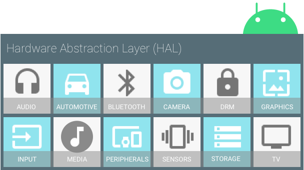

# Android Platform Architecture
Based on their [documentation](https://developer.android.com/guide/platform),
Android consists of six layers that build on top of the Linux Kernel.
The diagram shown below:

## [Linux Kernel](https://developer.android.com/guide/platform#linux-kernel)
The foundation of the Android platform is the Linux kernel. For example, the Android Runtime (ART) 
relies on the Linux kernel for underlying functionalities such as **threading and low-level memory 
management**.

Using a Linux kernel allows Android to take advantage of key security features and allows device 
manufacturers to develop hardware drivers for a well-known kernel. 

***But why they used Linux Kernel?*** Android uses the Linux kernel under the hood. Because Linux is 
open-source, Google's Android developers could modify the Linux kernel to fit their needs. **Linux 
gives the Android developers a pre-built, already maintained operating system kernel to start with 
so they don't have to write their own kernel.**

## [Hardware Abstraction Layer](https://developer.android.com/guide/platform#hal)

The hardware [abstraction layer (HAL)](https://source.android.com/devices/architecture/hal-types) 
provides standard interfaces that expose device hardware 
capabilities to the higher-level [Java API framework](https://developer.android.com/guide/platform#api-framework). 
The HAL consists of multiple library modules, 
each of which implements an interface for a specific type of hardware component, such as the camera 
or bluetooth module. When a framework API makes a call to access device hardware, the Android system 
loads the library module for that hardware component. 

According to [Infrastructure Middleware (Part 1): the Android Hardware Abstraction Layer](https://www.youtube.com/watch?v=dHXJA8D8Zf0):
* **HAL helps to separate concerns in the Android system architecture**: The layers on top of it can be 
    simplified.
* **Decouples Android platform software from hardware**: apps don't break when hardware changes
* **Decouples Android framework layer from the operating system layer**: this layer can be programmed
    via method calls on Java objects, rather than C system function calls. So App developers can thus focus
    on business logic, rather than low-level details.
  
In other means, [The hardware abstraction layout (HAL)](https://source.android.com/devices/architecture/hal)
bridges hardware capabilities to the higher-level 
Java API Framework by defining standard interfaces, allowing you to implement the low-level 
functionalities without modifying the higher-level systems.

## [Android Runtime](https://developer.android.com/guide/platform#art)
ART was invented to replace the Dalvik virtual machine for devices running Android version 5.0 (Lollipop) 
or higher, each app runs in its own process 
and with its own instance of the [Android Runtime (ART)](https://source.android.com/devices/tech/dalvik/index.html). 
ART is written to **run multiple virtual 
machines on low-memory devices by executing DEX files**, a bytecode format designed specially for 
Android that's optimized for minimal memory footprint. Build tools, such as d8, compile Java sources 
into DEX bytecode, which can run on the Android platform.

Some of the major features of ART include the following:
* Ahead-of-time (AOT) and just-in-time (JIT) compilation
* Optimized garbage collection (GC)
* On Android 9 (API level 28) and higher, conversion of an app package's 
  [Dalvik Executable format (DEX) files to more compact machine code](https://developer.android.com/about/versions/pie/android-9.0#art-aot-dex).
* Better debugging support, including a dedicated sampling profiler, detailed diagnostic exceptions and crash reporting, and the ability to set watchpoints to monitor specific fields

#### Notes:
* .dex files are similar to java class files, but they were run under the Dalvik Virtual Machine 
  (DVM) on older Android versions, and compiled at install time on the device to native code with 
  ART on newer Android versions.
* The main role of ART is to execute the Dalvik Executable format (DEX) by translating DEX bytecode 
  into machine code that your system can understand.
* [Infrastructure Middleware (Part 2): Android Runtime Execution Environment](https://www.youtube.com/watch?v=CKax4-Y8FyE)

## [Native C/C++ Libraries](https://developer.android.com/guide/platform#native-libs)
Many core Android system components and services, such as ART and HAL, are built from native code 
that require native libraries written in C and C++. The Android platform provides Java framework APIs 
to expose the functionality of some of these native libraries to apps. For example, you can access 
[OpenGL ES](https://developer.android.com/guide/topics/graphics/opengl) through the Android framework’s 
[Java OpenGL API](https://developer.android.com/reference/android/opengl/package-summary) to add 
support for drawing and manipulating 2D and 3D graphics in your app.

Useful source: [Infrastructure Middleware (Part 3): Android Runtime Core and Native Libraries](https://www.youtube.com/watch?v=xFd2rt7GZuo)

## [Java API Framework](https://developer.android.com/guide/platform#api-framework)
The entire feature-set of the Android OS is available to you through APIs written in the Java language. 
These APIs form the building blocks you need to create Android apps by simplifying the reuse of core, 
modular system components and services, which include the following:

* A rich and extensible View System you can use to build an app’s UI, including lists, grids, text 
  boxes, buttons, and even an embeddable web browser
* A Resource Manager, providing access to non-code resources such as localized strings, graphics, 
  and layout files
* A Notification Manager that enables all apps to display custom alerts in the status bar
* An Activity Manager that manages the lifecycle of apps and provides a common navigation back stack
* Content Providers that enable apps to access data from other apps, such as the Contacts app, or 
  to share their own data

One of the more powerful APIs in the Java API framework is **Android Jetpack**, which is pushed by Google. 
Jetpack **accelerates development speed by reducing boilerplate code so that developers can focus on the 
code they care about**.

Also, it provides solutions like Lifecycle, UI toolkit, Navigation, Security, Caching, Scheduler, 
Dependency Injection, and a lot more. You’ll cover this deeply in future posts.

## [System Apps](https://developer.android.com/guide/platform#system-apps)
Android comes with a set of core apps for email, SMS messaging, calendars, internet browsing, 
contacts, and more. Apps included with the platform have no special status among the apps the user 
chooses to install. So a third-party app can become the user's default web browser, SMS messenger, 
or even the default keyboard (some exceptions apply, such as the system's Settings app).

The system apps function both as apps for users and to provide key capabilities that developers can 
access from their own app. For example, **if your app would like to deliver an SMS message, you don't 
need to build that functionality yourself—you can instead invoke whichever SMS app is already installed 
to deliver a message to the recipient you specify**.

### More at [Android Platform Architecture](https://developer.android.com/guide/platform)  

### Source
* https://getstream.io/blog/android-developer-roadmap/
* https://developer.android.com/guide/platform
