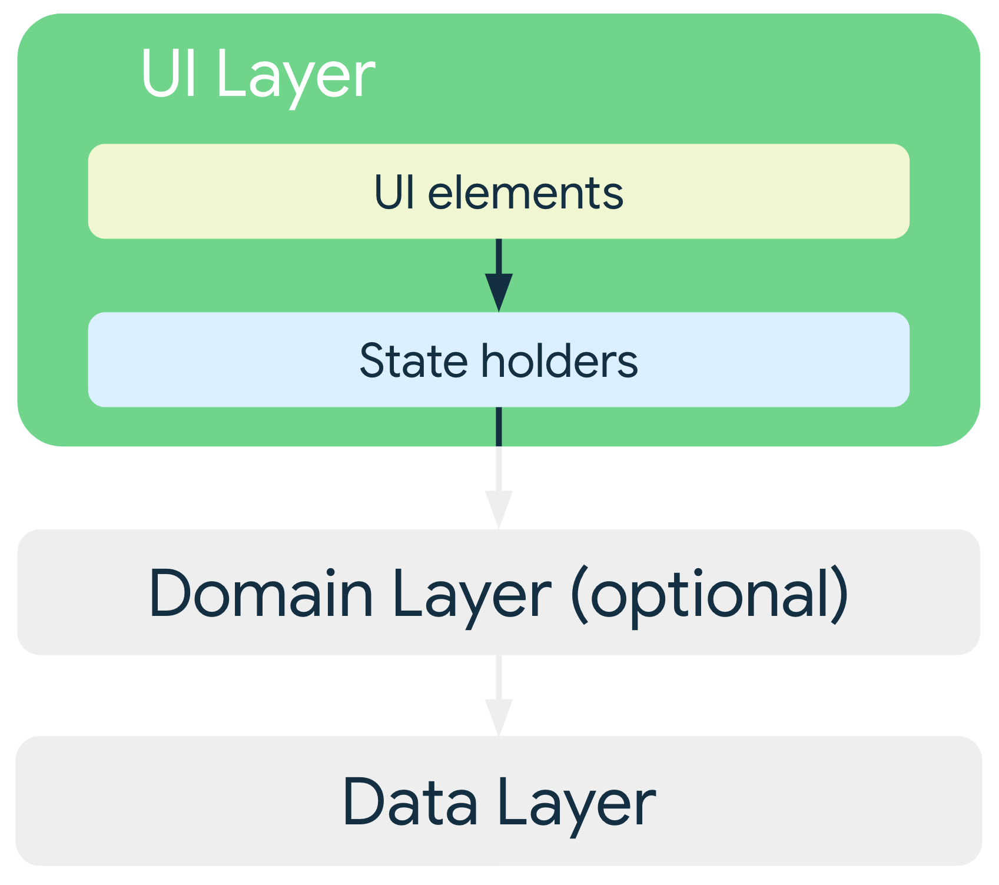

# App Architecture
If you shouldn't use app components to store application data and state, how should you design your 
app instead?

As Android apps grow in size, it's important to define an architecture that **allows the app to scale, 
increases the app's robustness, and makes the app easier to test**.

An app architecture defines **the boundaries between parts of the app and the responsibilities each 
part should have**. In order to meet the needs mentioned above, you should design your app 
architecture to follow a few specific principles.

Keep in mind that you **don't own implementations of `Activity` and `Fragment`; rather, 
these are just glue classes that represent the contract between the Android OS and your app**. 
The OS can destroy them at any time based on user interactions or because of system conditions 
like low memory. To provide a satisfactory user experience and a more manageable app maintenance 
experience, it's best to minimize your dependency on them.

## Recommended app architecture
Considering the common architectural principles mentioned in the previous section, each application 
should have at least two layers:

* The UI layer that displays application data on the screen.
* The data layer that contains the business logic of your app and exposes application data.

You can add an additional layer called the domain layer to simplify and reuse the 
interactions between the UI and data layers.

### UI Layer
The role of the UI layer (or _presentation layer_) is to **display the application data on the screen**. 
Whenever the data changes, either due to user interaction (such as pressing a button) or external 
input (such as a network response), the UI should update to reflect the changes.

The UI layer is made up of two things:

* UI elements that render the data on the screen. You build these elements using Views or Jetpack 
  Compose functions.
* State holders (such as ViewModel classes) that hold data, expose it to the UI, and handle logic.

### Data Layer
The data layer of an app contains the _business logic_. The business logic is **what gives value to your 
app—it's made of rules that determine how your app creates, stores, and changes data**.

The data layer is made of repositories that each can contain zero to many data sources. You should 
create a repository class for each different type of data you handle in your app. For example, you 
might create a `MoviesRepository` class for data related to movies, or a `PaymentsRepository` class for 
data related to payments.

Repository classes are responsible for the following tasks:

* Exposing data to the rest of the app.
* Centralizing changes to the data.
* Resolving conflicts between multiple data sources.
* Abstracting sources of data from the rest of the app.
* Containing business logic.

Each data source class should have the responsibility of working with only one source of data, 
which can be a file, a network source, or a local database. Data source classes are the bridge 
between the application and the system for data operations.

**See more details on [Guide to app architecture](https://developer.android.com/topic/architecture)**

Useful resource: [Android Guide to App Architecture Explained in 3 Minutes](https://youtu.be/4L3-DW-z7iI)