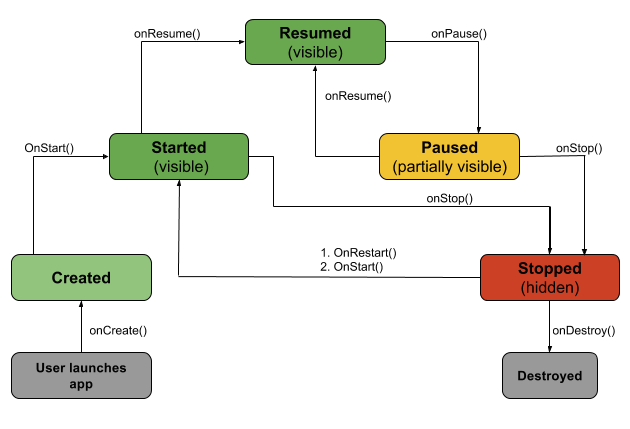

# Activities
An activity is the entry point for interacting with the user. **It represents a single screen with a 
user interface**. For example, an email app might have one activity that shows a list of new emails, 
another activity to compose an email, and another activity for reading emails. **Although the 
activities work together to form a cohesive user experience in the email app, each one is 
independent of the others. As such, a different app can start any one of these activities if the 
email app allows it.** For example, a camera app can start the activity in the email app that composes 
new mail to allow the user to share a picture. An activity facilitates the following key 
interactions between system and app:

* Keeping track of what the user currently cares about (what is on screen) to ensure that the system 
keeps running the process that is hosting the activity.
* Knowing that previously used processes contain things the user may return to (stopped activities), 
and thus more highly prioritize keeping those processes around.
* Helping the app handle having its process killed so the user can return to activities with their 
previous state restored.
* Providing a way for apps to implement user flows between each other, and for the system to coordinate 
these flows. (The most classic example here being share.)

You implement an activity as a subclass of the `Activity` class.

An activity is implemented as a subclass of Activity class as follows −

```kotlin
class MainActivity : AppCompatActivity() {
    // bla bla bla
}
```

## Activity Lifecycle


Based on the diagram above, let's look closer into it:
* `onCreate():` Called by the OS when the activity is **first created.** **This is where you initialize
any UI elements or data objects**. You also have the `savedInstanceState` of the activity that contains 
its previously saved state, and you can use it to recreate that state.


* `onStart()`: **Just before presenting the user with an activity, this method is called**. It’s always 
followed by `onResume()`. In here, you generally should start UI animations, audio based content or 
anything else that requires the activity’s contents to be on screen.


* `onResume()`: **As an activity enters the foreground, this method is called**. Here you have a good 
place to restart animations, update UI elements, restart camera previews, resume audio/video 
playback or initialize any components that you release during `onPause()`.


* `onPause()`: **This method is called before sliding into the background**. Here you should stop any 
visuals or audio associated with the activity such as UI animations, music playback or the camera. 
**This method is followed by `onResume()` if the activity returns to the foreground or by `onStop()` if 
it becomes hidden**.


* `onStop()`: **This method is called right after `onPause()`**, when the activity is no longer visible 
to the user, and it’s a good place to **save data that you want to commit to the disk**. It’s followed 
by either `onRestart()`, if this activity is coming back to the foreground, or `onDestroy()` if it’s 
being released from memory.


* `onRestart()`: **Called after stopping an activity, but just before starting it again**. 
Called after your activity has been stopped, prior to it being started again. It’s always 
followed by `onStart()`.


* `onDestroy()`: **This is the final callback you’ll receive from the OS before the activity is 
destroyed**. You can trigger an activity’s destruction by calling `finish()`, or **it can be triggered 
by the system when the system needs to recoup memory**. If your activity includes any background 
threads or other long-running resources, destruction could lead to a memory leak if they’re not 
released, so you need to **remember to stop these processes here as well**.


### Source 
* https://www.raywenderlich.com/2705552-introduction-to-android-activities-with-kotlin#toc-anchor-002