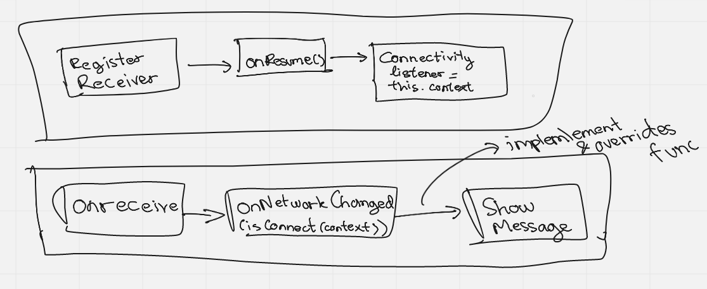

# Broadcast Receiver
A broadcast receiver is a component that enables the system to **deliver events to the app outside of 
a regular user flow**, allowing the app to **respond to system-wide broadcast announcements**. Because 
broadcast receivers are another well-defined entry into the app, the system can deliver broadcasts 
even to apps that aren't currently running.

A broadcast receiver (receiver) is an Android component which allows you to register for system or 
application events. All registered receivers for an event are notified by the Android runtime once 
this event happens.

For example, applications can register for the `ACTION_BOOT_COMPLETED` system event which is 
fired once the Android system has completed the boot process.

### Source
* https://developer.android.com/guide/components/fundamentals
* https://www.vogella.com/tutorials/AndroidBroadcastReceiver/article.html

# Learn how it works
Here is the diagram on how 
[Check connectivity with Broadcast Receiver](../../../appcomponent/src/main/java/com/krossmanzs/appcomponent/broadcast_receiver)
works

** In case, I forget it in the future

**We pass the `isConnected` parameter on `override fun onNetworkConnectionChanged(isConnected: Boolean)` 
when we passing it from the ConnectivityReceiver class (Where the interface from)**