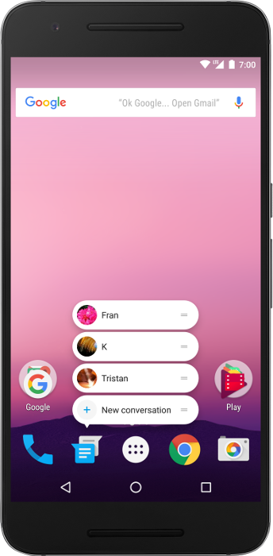

# App Shortcut

We can define shortcuts to perform specific actions in our app. These shortcuts can be displayed
in a supported launcher or assistant, like Google Assistant, and help users quickly start common
or recommended tasks on our app.

# Shortcut Types
Each shortcut references one or more `intents`, each of which launches a specific action in our app
when users select the shortcut. The types of shortcuts that we create for our app depend on the
app's key use cases. Examples of actions we can express as shortcuts include the following:
* Composing a new email in an app.
* Navigating users to a particular location in a mapping app.
* Sending messages to a friend in a communication app.
* Playing the next episode of a TV show in a media app.
* Loading the last save point in a gaming app.
* Ordering a drink in a delivery app with your voice, using spoken commands.

We can publish the following types of shortcuts for our app:
* _Static shortcuts_ are defined in a resource file that is packaged into an APK or 
[app bundle](https://developer.android.com/guide/app-bundle/build).
* _Dynamic shortcuts_ can be pushed, updated, and removed by our app only at runtime.
* _Pinned shortcuts_ can be added to supported launchers at runtime, if the user grants permission.

**More details at [App shortcuts overview](https://developer.android.com/guide/topics/ui/shortcuts)**

### Note
Only main activities—activities that handle the `Intent.ACTION_MAIN` action and the 
`Intent.CATEGORY_LAUNCHER` category—can have shortcuts. If an app has multiple main activities, 
you need to define the set of shortcuts for each activity. 

