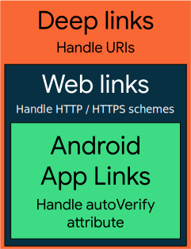

# Handling Android App Links
Users following links on devices have one goal in mind: **to get to the content they want to see**. As
we can set up Android App Links to **take users to a link's specific content directly
in our app**, bypassing the app-selection dialog, also known as the **disambiguation dialog**. Because
Android App Links leverage HTTP URLs and association with a website, users who don't have your
app installed go directly to content on your site.

Based on [The definition of Android App Links](https://www.adjust.com/glossary/android-app-links/),
Android App Links are http URLs that send users to a specific in-app location or relevant webpage.
App Links improve the user experience by eliminating the time users otherwise waste on navigating
to specific content. They also make it easier for users to share content. Developers can use
Android App Links to ensure the user is taken directly to their desired in-app location.

## Difference between Deep Links and Android App Links
Deep links are URLs that send users to in-app content. With Adjust, deep links can also defer to the
app store if the app is not yet installed, then send the user to the right location after install.
They can be set up on Android using intent filters and extracting data from incoming intents -
driving users to the correct in-app location.

A significant difference between deep links and Android App Links is that with the former, the user
may be redirected to the app (when app is installed) or to the Play Store (when app is not installed).
This differs from Android App Links: on Android 6.0 (API level 23) and higher, apps can be
designated as the default handler of Android App Links. If this isn't preferable for the user, they 
can change the default handler in their device's system settings.

## Deep Links
_Deep links_ are URIs of any scheme that take users directly to a specific part of your app. To create
deep links, add intent filters to drive users to the right activity in your app.

## Web Links
_Web links_ are deep links that use the HTTP and HTTPS schemes. On Android 12 and higher, clicking a
web link (that is not an Android App Link) always shows content in a web browser. On devices running
previous versions of Android, if our apps installed on a user's device can also handle the web link,
users might not go directly to the browser. Instead, they'll see a disambiguation dialog similar to
one that appears like the image above.

## Android App Links
_Android App Links_, available on **_Android 6.0 (API level 23)_** and higher, are web links that **use the
HTTP and HTTPS schemes and contain the `autoVerify` attribute**. This attribute **allows our app to
designated itself as the default handler of a given type of link**. So when the user clicks on an
Android App Link, our app opens immediately if it's installed--the disambiguation dialog doesn't
appear

Android App Links offer the following benefits:
* Secure and specific
* Seamless user experience
* Android Instant Apps support
* Engage users from Google Search
* More details at [Android App Links benefits](https://developer.android.com/training/app-links#android-app-links)

**More details at [What are Android App Links?](https://www.adjust.com/glossary/android-app-links/) or
[Handling Android App Links](https://developer.android.com/training/app-links)**