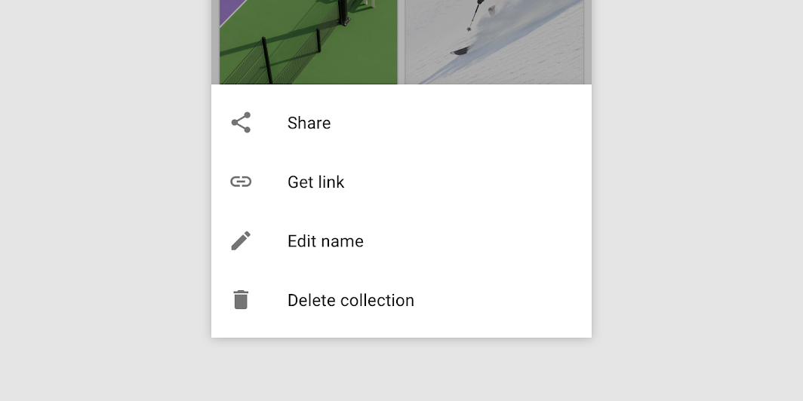
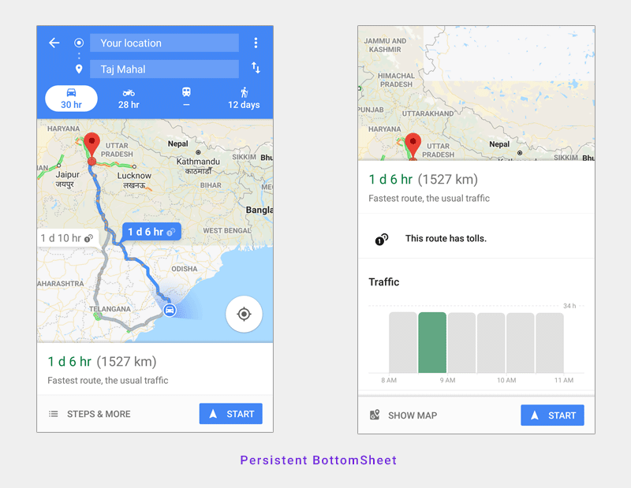

# BottomSheetDialogFragment

## Modal Bottom Sheets
It can be implemented using BottomSheetDialog or BottomSheetDialogFragment. Elevation is higher
than the app. It is fundamentally acting as the dialog.

`Bottom Sheets` are surfaces containing supplementary content that are anchored to the bottom of
the screen.

## Persistent Bottom Sheets
It can be implemented using `BottomSheetBehavior` in conjunction with a `CoordinatorLayout`

The Persistent bottom sheet **displays in-app content**. It will be displayed at the **bottom of the 
screen making some portion of the content visible**. **when activated it opens the full content**. The
elevation of the persistent bottom sheet is same as app making it part of the app. Below is the
example of persistent bottom sheet of 
**Google Maps** app. _[source](https://www.androidhive.info/2017/12/android-working-with-bottom-sheet/)_

Learn to create BottomSheetDialogFragment:
[Using BottomSheetDialogFragment with Material Design Guideline](https://medium.com/@kosta.palash/using-bottomsheetdialogfragment-with-material-design-guideline-f9814c39b9fc)