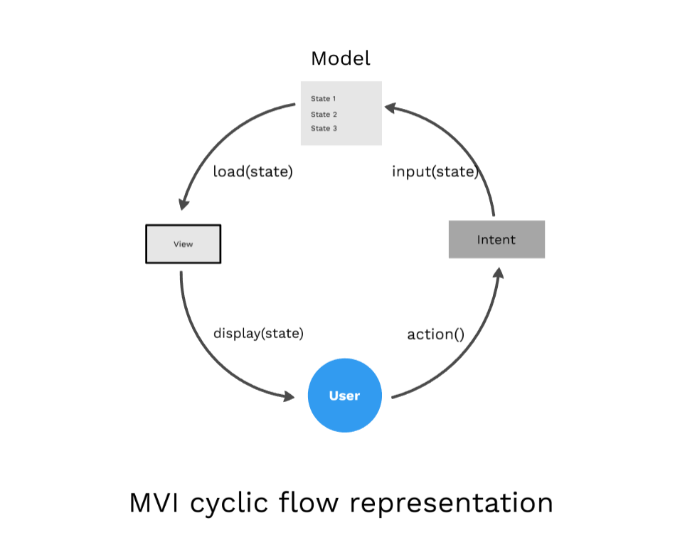

# MVI (Model-View-Intent)
This pattern has been introduced recently in Android. It works based on the principle of
unidirectional and cylindrical flow inspired by the Cycle.js framework.

## Roles
* **Model**: Unlike other patterns, In MVI Model represents the state of the UI. i.e UI might have
    different states like Data Loading, Loaded, Change in UI with user Actions, Errors, User current
    screen position states. Each state is stored as similar to the object in the model.
* **View**: The View in the MVI is our Interfaces which can accept the different model states and 
    display it as a UI. They use observable intents(Note: This doesn't represent the Android
    traditional Intents) to respond to user actions.
* **Intent**: Even though this is not an Intent as termed by Android from before. The result of the
    user actions is passed as an input value to Intents. In turn, we can say we will be sending 
    models as inputs to the Intents which can load it through Views.

## How does MVP work?
1. User does an action which will be an Intent
2. Intent is a state which is an input to model
3. Model stores state and send the requested state to the View
4. View Loads the sate from Model
5. Displays to the user

If we observe, **the data will always flow from the user and end with the user through intent**. It
cannot be the other way, Hence its called Unidirectional architecture. If the user does one more
action the same cycle is repeated, hence it is Cyclic.

## Advantages
* Maintaining state is no more a challenge with this architecture, As it focuses mainly on states.
* As it is unidirectional, Data flow can be tracked and predicted easily.
* It ensures thread safety as the state objects are immutable.
* Easy to debug, As we know the state of the object when the error occurred.
* It's more decoupled as each component fulfills its own responsibility.
* Testing the app also will be easier as we can map the business logic for each state.

## Disadvantages
* It leads to lots of boilerplate code as we have to maintain a state for each user action.
* As we know it has to create lots of objects for all the states. This makes it too costly for app
    memory management.
* Handling alert states might be challenging while we handle configuration changes. For example, if
    there is no internet we will show the snackbar, On configuration change, it shows the snackbar
    again as its the state of the intent. In terms of usablility, this has to be handled.

## Source
* [MVI Architecture - Android Tutorial for Beginners - Step By Step Guide](https://blog.mindorks.com/mvi-architecture-android-tutorial-for-beginners-step-by-step-guide)