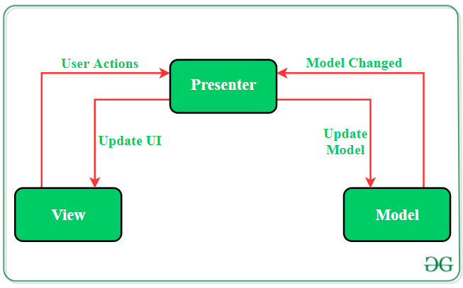

# MVP (Model-View-Presenter)
**MVP** is an architectural pattern which mostly used for building user interfaces. In **MVP**, the presenter
assumes the functionality of the **"middle-man"**. In **MVP**, all presentation logic is pushed to the
presenter. **MVP** advocates separating business and persistence logic out of the Activity and Fragment.

**MVP** comes into the picture as an alternative to the traditional MVC (Model-View-Controller) 
architecture pattern. The reason why MVP is widely accepted is that it provides modularity, testability,
and a more clean and maintainable codebase. It is composed of the following three components:
* **Model**: Layer for storing data. It is responsible for handling the domain logic (real-world business
    rules) and communication with the database and network layers.
* **View**: UI(User Interface) layer. It provides the visualization of the data and keep a track of the
    user's action in order to notify the Presenter.
* **Presenter**: Fetch the data from the model and applies the UI logic to decide what to display. It 
    manages the state of the View and takes actions according to the user's input notification from
    the View.

## Key Points of MVP Architecture
1. Communication between View-Presenter and Presenter-Model happens via **interface(also called Contract)**.
2. One Presenter class manages one View at a time i.e., there is a one-to-one relationship between
    Presenter and View.
3. Model and View class doesn't have knowledge about each other's existence.

**Read more at [MVP (Model View Presenter) Architecture Pattern in Android with Example](https://www.geeksforgeeks.org/mvp-model-view-presenter-architecture-pattern-in-android-with-example/)**

### Source
* [Android Architecture Patterns](https://medium.com/cr8resume/make-you-hand-dirty-with-mvp-model-view-presenter-eab5b5c16e42)
* [MVP (Model View Presenter) Architecture Pattern in Android with Example](https://www.geeksforgeeks.org/mvp-model-view-presenter-architecture-pattern-in-android-with-example/)