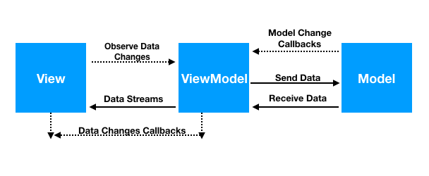

# MVVM (Model-View-ViewModel)
* **Model**: This holds the data of the application. It cannot directly talk to the View. Generally,
    it's recommended to expose the data to the ViewModel through Observables.
* **View**: It represents the UI of the application devoid of any Application Logic. It observes
    the ViewModel.
* **ViewModel**: It acts as a link between the Model and the View. It's responsible for transforming
    the data from the Model. It provides data streams to the View. It also uses hooks callbacks to
    update the View. It'll ask for the data from the Model

The following flow illustrates the core MVVM Pattern.

### Source
* [Android MVVM Design Pattern](https://www.journaldev.com/20292/android-mvvm-design-pattern)