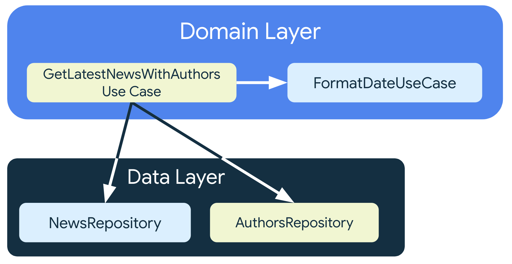

# Domain Layer
The domain layer is an _optional_ layer that sits between the UI layer and the data layer.


The domain layer is responsible for encapsulation complex business logic, or simple business logic
that is reused by multiple ViewModels. This layer is optional because not all apps will have these
requirements. You should only use it when needed-for example, to handle complexity or favor reuseability.

A domain layer provides the following benefits:
* It avoids code duplication.
* It improves readability in classes that use domain layer classes.
* It improves the testability of the app.
* It avoids large classes by allowing you to split responsibilities.

To keep theses classes simple and lightweight, each use case should only have responsibility over
a single functionality, and they should not contain mutable data. You should instead handle mutable
data in your UI or data layers.

## Dependencies
In a typical app architecture, use case classes fit between ViewModels from the UI layer and 
repositories from the data layer. This means that use case classes usually depend on repository 
classes, and they communicate with the UI layer the same way repositories do--using either callbacks(for Java)
or coroutines (for Kotlin). 

For example, in your app, you might have a use case class that fetches data from a news repository
and an author repository, and combines them:

```kotlin
class GetLatestNewsWithAuthorsUseCase(
    private val newsRepository: NewsRepository,
    private val authorsRepository: AuthorsRepository
) { /* ... */ }
```

Because use cases contain reusable logic, they can also be used by other use cases. It's normal to 
have multiple levels of use cases in the domain layer. For example, the use case defined in the example
below can make use of the `FormatDateUseCase` use case if multiple classes from the UI rely on time
to display the proper message on the screen:

```kotlin
class GetLatestNewsWithAuthorsUseCase(
    private val newsRepository: NewsRepository,
    private val authorsRepository: AuthorsRepository,
    private val formatDateUseCase: FormatDateUseCase
) { /* ... */ }
```



More details at [Domain Layer Documentation](https://developer.android.com/topic/architecture/domain-layer)
