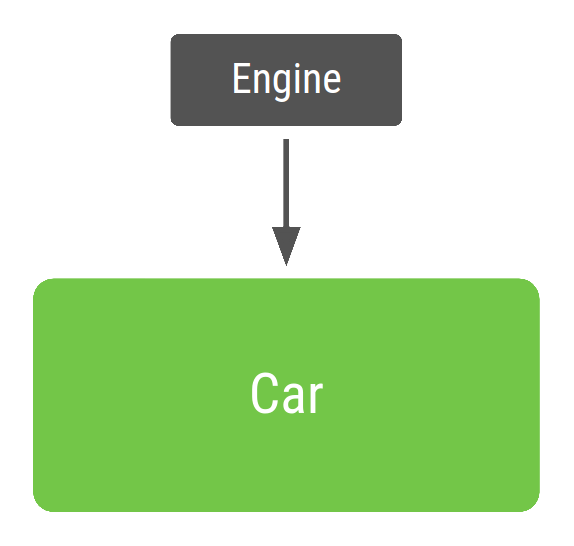

# Dependency Injection
Dependency Injection (DI) is a technique widely used in programming and well suited to Android
development. By following the principles of DI, we lay the groundwork for good app architecture.

Implementing DI provides the following advantages:
* Reusability of code
* Ease of refactoring
* Ease of testing

## Fundamentals of Dependency Injection
Classes often require references to other classes. For example, a `Car` class might need a reference
to an `Engine` class. These required classes are called _dependencies_, and in this example the `Car`
class is dependent on having an instance of the `Engine` class to run.

There are three ways for a class to get an object it needs:
1. The class constructs the dependency it needs. In the example above, `Car` would create and initialize
    its own instance of Engine.
2. Grab it from somewhere else. Some Android APIs, such as `Context` getters and `getSystemService()`
    , work this way.
3. Have it supplied as a parameter. The app can provide these dependencies when the class is constructed
    or pass them in to the functions that need each dependency. In the example above, the `Car`
    constructor would receive `Engine` as a parameter. **_(THIS IS CALLED DEPENDENCY INJECTION)_**

There are two major ways to do dependency injection in Android:
* **Constructor Injection**. 
* **Field Injection (or Setter Injection)**. 

## Constructor Injection
We pass the dependencies of a class to its constructor.. Here's an example. Without dependency Injection, 
representing a `Car` that creates its own `Engine` dependency in code looks like this:

```kotlin
class Car {
    private val engine = Engine()
    
    fun start() {
        engine.start()
    }
}

fun main(args: Array) {
    val car = Car()
    car.start()
}
```


This is not example of DI because the `Car` class is constructing its own `Engine`. This can be
problematic because:
* `Car` and `Engine` are tightly coupled - and instance of `Car` uses one type of `Engine`, and no
    subclasses or alternative implementations can easily be used.
* The hard dependency on `Engine` makes testing more difficuld. `Car` uses a real instance of `Engine`
    , thus preventing you from using a [test double](https://en.wikipedia.org/wiki/Test_double) to
    modify `Engine` for different test cases.


This is the code look like with DI:

```kotlin
class Car(private val engine: Engine) {
    fun start() {
        engine.start()
    }
}

fun main(args: Array) {
    val engine = Engine()
    val car = Car(engine)
    car.start()
}
```



The `main` function uses `Car`. Because `Car` depends on `Engine`, the app creates an instance of
`Engine` and then uses it to construct an instance of `Car`. The benefits of this DI-based:
* Reusability of `Car`. You can pass in different implementations of `Engine` to `Car`.
* Easy testing of `Car`. You can pass in tesst doubles to test your different scenarios.

## Field Injection (or Setter Injection)
Certain Android Framework classes such as activities
and fragments are instantiated by the system, so constructor injection is not possible. With
field injection, **dependencies are instantiated after the class is created**.

```kotlin
class Car {
    lateinit var engine: Engine
    
    fun start() {
        engine.start()
    }
}

fun main(args: Array) {
    val car = Car()
    car.engine = Engine()
    car.start()
}
```

**More details at [Dependency injection in Android](https://developer.android.com/training/dependency-injection#kotlin)**

### Notes
* Test Double adalah objek tiruan yang berfungsi untuk menggantikan objek aslinya yang dibutuhkan 
    oleh Objek yang kita testing.
* [Jenis Test Double](https://www.huzefril.com/posts/testing/jenis_test_double/)