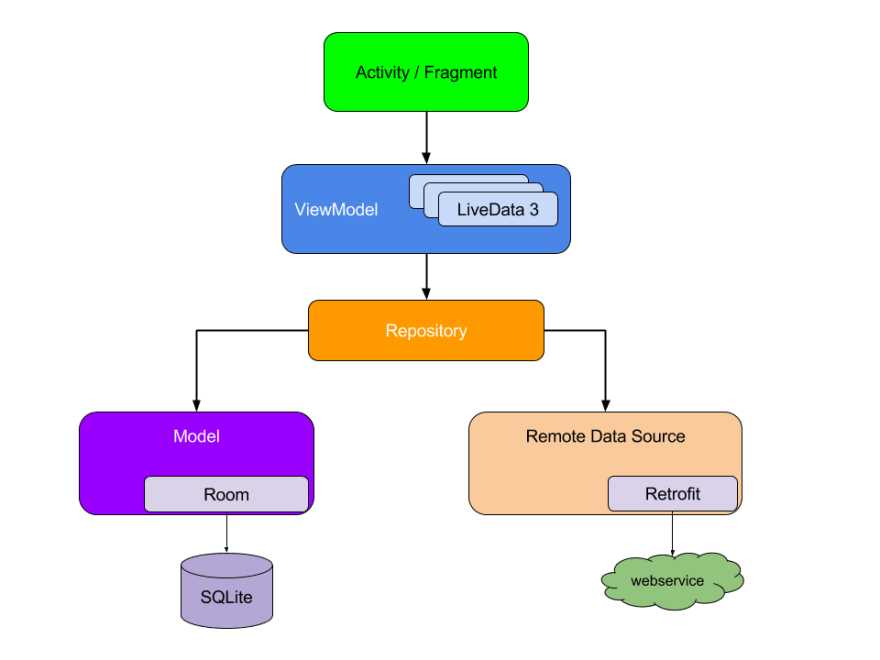
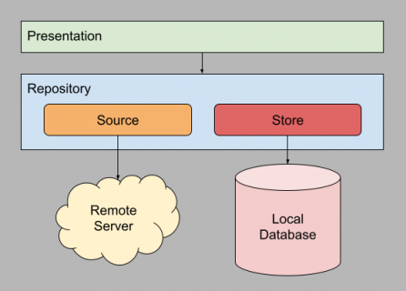

# Repository Pattern I
The **Repository Pattern** is an abstraction used to hide the multiple data sources we may have in
our application, data in an application may come from an internal database, or, an external service
such as a Web API. This pattern is adopted and widely used when developing Android applications, 
it's also recommended approach to creating an application. The following diagram displays a generic
mobile application architecture on Android.

What we can take from this diagram is the following:
Our Activity/Fragment may or may not have one, or multiple instances of different ViewModels, e**ach
view model has a dependency to a specific repository**, this repository can be shared by multiple view
models.

**The repository knows the data sources from where to retrieve information**, in this case, the repository
knows the Model, which is Room, a layer on top of SQLite, and a service interface, which is provided
by Retrofit in order to communicate to a web service. Each layer only knows the layer below. The 
ViewModel doesn't know who the repository interacts with.

# Repository Pattern II
A repository defines data operations. The most common operations are creating, reading, updating,
and deleting data, (also known as **CRUD**). These operations sometimes need parameters that define
how to run them. For instance, a parameter could be a search term to filter results.

The repository pattern is a structural design pattern. **It's instrumental for organizing how you
access data**. It also helps divide concerns into smaller parts. The repository pattern was first
introduced in 2004 by _Eric Evans_ in his book, _Domain-Driven Design: Tackling Complexity_ in the
_Heart of Software._

### Source
* [Android: Repository pattern using Room, Retrofit and Coroutines ](https://dev.to/rodrassilva/android-repository-pattern-using-room-retrofit-and-coroutines-58kb)
* [Repository Pattern with Jetpack Compose](https://www.raywenderlich.com/24509368-repository-pattern-with-jetpack-compose#toc-anchor-002)